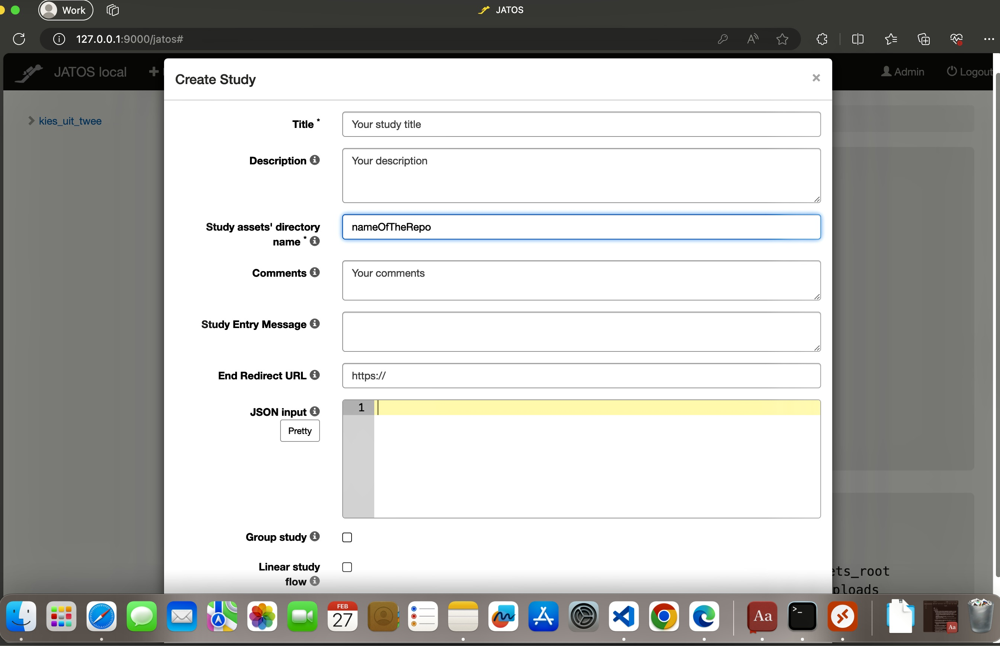

# hoeZegJijIetsmet: Psychology Study at Vrije Universiteit Amsterdam

This repository contains the code for a work-in-progress psychology study at Vrije Universiteit Amsterdam [Hoe Zeg Jij Iets met](https://www.hoezegjijietsmet.nl). The study is designed to run with [JATOS](https://www.jatos.org/Whats-JATOS.html) (Just Another Tool for Online Studies), an open source tool for running online experiments.

## Getting Started

- To run this repository it is necessary to have java and javascript installed. 
- It is also necessary to have Jatos installed. Please follow the [Jatos installation guide](https://www.jatos.org/Installation.html).

## Running the Experiment

After downloading JATOS in your system, navigate to the jatos folder with a terminal and use the proper loader file for your system.

- On Windows, use `loader.bat`.
- On macOS or Linux, use `loader.sh`.

Do the following command in your terminal: `./loader.sh start`, this will create a localhost server at `127.0.0.1:9000`.

Once you have started JATOS successfully, navigate to the folder study_assets_root and do:

`git clone https://github.com/Sergi095/hoeZegJijIetsmet.git`

After cloning this repository inside JATOS, you can can create a new study under New Study in JATOS, and name the study assets directory as the repository.

After accessing to your JATOS locally, you need to create a new study, and put the code of this repository under "study_assets_root/name_study".

